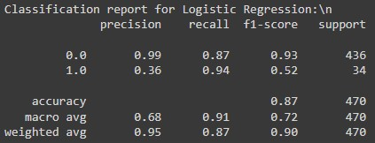
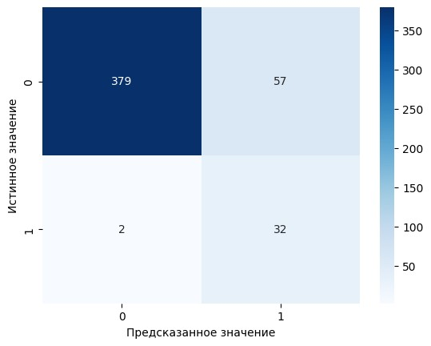

# Prediction-of-Adverse-Outcomes-in-Patients-with-NSTE-ACS
Прогнозирование неблагоприятных исходов у пациентов с острым коронарным синдромом без подъёма сегмента ST (ОКСбпST).

## О чём этот проект
В этом проекте содержится работа по извлечению данных из МИС (медицинской информационной системы), обработке извлеченных данных и обучению моделей МО для прогнозирования неблагоприятных исходов у пациентов с ОКСбпST.

## Извлечение данных из МИС
Извлечение данных из МИС проводилось в два этапа. Сначала был написан запрос для извлечения пациентов с данными клинического диагноза, ЭКГ, протоколом операции, коронарографией и эхокардиографией. Каждая группа данных извлекалась по отдельности и сохранялась в свой csv-файл (для ускорения выполнения запросов на сервере). Далее был написан запрос для извлечения лабораторных данных. Для ускорения выполениня запроса на сервере в нём использовалась временная таблица, хранящая все лабораторные тесты. В результате проделанной работы были получены 6 csv-файлов, содержащих данные о пациентах.

## Обработка данных и создание единого Data Frame
Сперва были обработаны по отдельности каждые 6 csv-файлов. Эти файлы представляли собой строки с пациентами, исходами их госпитализации, ключами и необработанными сырыми данными. В обработку файлов входило: выявление новых полезных признаков из сырых данных с помощью регулярных выражений, удаление лишней информации (включая столбец с сырыми данными после извлечения из него полезных признаков) и слияние дублирующихся строк. Затем все 6 таблиц были объединены по ключам в единый Data Frame.

## Предобработка данных и обучение моделей
Предобработка данных включала в себя обработку пропущенных значений, создание новых признаков с использованием существующих, удаление менее значащих или неподходящих признаков и различные эксперименты с ними. Были обучены 5 моделей МО: логистическая регрессия, дерево решений, случайный лес, градиентный бустинг и метод опорных векторов (SVM). Наиболее удачные результаты показала **логистическая регрессия** при использовании 10 наиболее важных для неё признаков. **Чувствительность** модели составила **0.94**, **специфичность - 0.87**, **точность (accuracy) - 0.87**.

## Результаты логистической регрессии

Отчёт о классификации и матрица ошибок.

